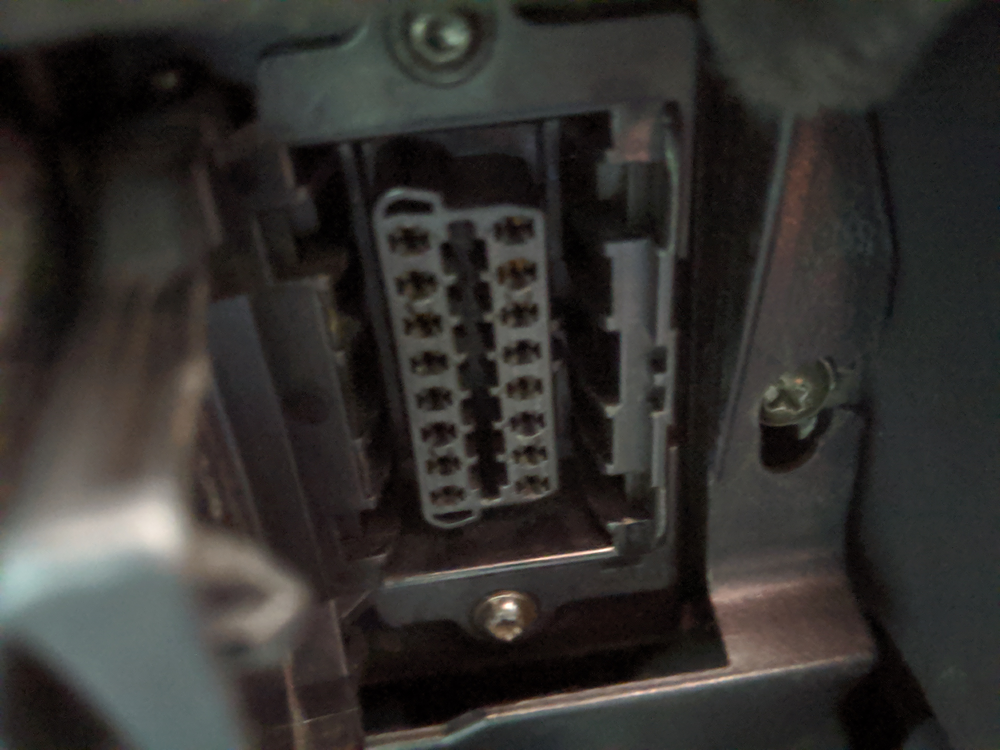

# Chapter 1: Vehicle Bus Protocols and Diagnostics

## Methodology

First you need to work out what you actually have in your car. What type of CAN (there are many). Google is your friend, or by looking at the OBD-II port under the dash

The OBD Standard allows for (five)[https://en.wikipedia.org/wiki/On-board_diagnostics#OBD-II_signal_protocols] signalling protocols. To check which one your car has, look to see which pins are active (you might need a flashlight)

### CAN Frames

Before you sniff traffic, you need to know what you are looking at. Most likely, it will be like so:

Seems hectic right? Well actually not that hectic, if you understand how the frames are created.

### Unified Diagnostic Services

Unified Diagnostic Service (**UDS**) according to the ISO 14229 standard is a protocol used by diagnostic systems to communicate with ECUs in vehicles. The protocol is used to diagnose errors and reprogram ECUs. For example, it is possible to read and delete the fault memory of an ECU or to flash a new firmware on the ECU.

It's important to note that Mercedes-Benz do not use standard UDS Arbitration IDs 0x7DF - 0x7E7. In order to use UDS, you should set the IDs lower, such as 0x300.

### Mercedes-Benz Specifics

The OBD-II port on all models are filtered (Either via the EIZ or SAM Module), they will allow reading of all can messages from all CAN networks within the car, however they **WILL ONLY** write diagnostic CAN ID's to write to the car's canbus networks, attempting to write a standard CAN ID to the cars network via the ODB-II Port will be rejected. They also require a wake-up code, which will be discussed in detail in Chapter 3. Unlike other models where you can simply plug into the CAN network and see a flurry of messages, this doesn't work like that with Mercedes-Benzs. 
  
[Next Chapter](Chapter%202%20Tools%20and%20Equipment.md)
