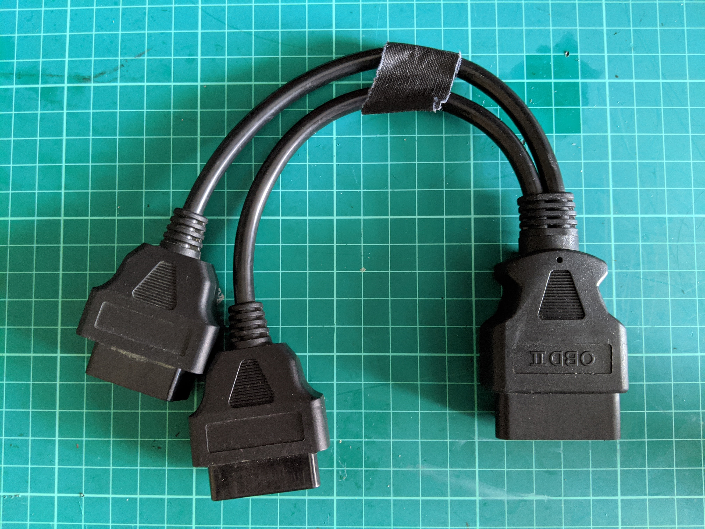
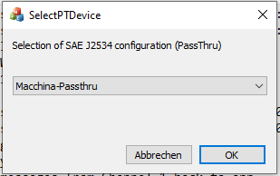

# Chapter 3: Connecting to the Vehicle

This chapter is possibly the most important of all chapters. You need to be in the car and communicating with the car in order to play around. As introduced in Chapter 1, finding the OBD-II port is the first step along with plugging in the cable and software to interface with the various CAN bus networks.

## Hardware Needed

In order to connect to the car in question, you'll need a number of parts, namely:

- 6Pin OBD2 Splitter Extension Cable Male to Dual Female Y Cable
- An interface to communicate with the car (via OBD-II or directly to the CANbus).



If possible, try and get the longest cable you can find, this makes it a lot easier to have loads of cables in the footwell of the car and not get all tangled up.

## Software Needed

@ash to add what he uses, VS code, flashing the macchina etc.

## Wake Up Command

Many modules require constant power in order to keep configurations stored and accessible, but for the best part, most modules will go into a sleep mode when the car is turned off. In order to query these components, a unique wake-up packet is required. For Mercedes-Benz, this wake-up sequence is unique to the model, and although some do share the same, it does vary from model to model.

Depending on your model, you should have already performed reconnaisance on what networks are present. For example:

- powertrain/chassis M-CAN (ISO CAN C high speed)
- interior (body) I-CAN (ISO CAN B low speed)
- diagnosis D-CAN (high speed proprietary MB protocol)
- Digital Media Bus for radio/navigation system (MOST).

The reconnaisance stage is really important as this sets the scene for everything else you do. Thankfully there exists a huge amount of documentation for Mercedes-Benz that shows exactly where the components are, what the wiring is and what networks are present.


Some newer vehicles do a better job of isolating the diagnostic port. It works for diagnostics but since it doesn’t have a steady stream of data, due to it only responding with data as requested, it makes it much harder to "sniff" the bus.

### K-line ISO 9141

This protocol, also known as Keyword Protocol 2000 or KWP. One underlying physical layer used for KWP2000 is identical to [ISO 9141](https://en.wikipedia.org/wiki/ISO_9141), with bidirectional [serial communication](https://en.wikipedia.org/wiki/Serial_communication) on a single line called the K-line. In addition, there is an optional L-line for wakeup. The data rate is between 1.2 and 10.4 [kilobaud](https://en.wikipedia.org/wiki/Baud), and a message may contain up to 255 bytes in the data field.

When implemented on a K-line physical layer KWP2000 requires special *wakeup* sequences: *5-baud wakeup* and *fast-initialisation*. Both of these wakeup methods require timing critical manipulation of the K-line signal. (thanks Wikipedia!)

The initialization consists of either a 25ms low followed by a 25ms high and 10.4kbps communication OR the 5 baud init which begins with a 200ms low, a 400ms high, a 400ms low, a 400ms high, a 400ms low and ends with a 200ms high.

### Mercedes-Benz model codes

As mentioned above, each model makes use of a unique wake-up code. There is no central repository that houses these codes, so we hope that we can crowdsource this table to all in the hope that we can create a single repository of all known codes.


| Mercedes-Benz model codes | Wake-up Packet ID | Wake-Up Packet Content |
| ------------------------- | ----------------- | ---------------------- |
| W203                      | 0x001C            | 0x0210920000000000     |
| W203                      | 0x001C            | 0x0210920000000000     |
| W211                      | 0x001C            | 0x0210920000000000     |
| W215                      | 0x001C            | 0x0210920000000000     |


#### Manual Code Discovery

If you do not have the unique code needed to wake the bus up, you can sniff for the sequence by plugging in a common diagnostics tool, such as any handheld reader or using the official Mercedes-Benz DAS Xentry software. This can be achieved by following these steps:

##### Requirments
* DAS/Xentry *Important: Must be passthru edition*
* [Macchina M2 Under-the-dash](https://www.macchina.cc/catalog/m2-boards/m2-under-dash)
* [M2UTD Passthru J2534 DLL](https://github.com/rnd-ash/m2-utd-passthru)
* Visual studio (Driver must be compiled at this time)
* Windows WSL recommended for monitoring packet log files

##### Configuring DAS/Xentry to use Custom DLL
1. Clone the M2UTD repository
2. Compile Driver DLL
3. Upload the Arduino code to your M2 UTD Unit using the Arduino IDE
4. From the driver repository, run `installer\install.bat`, this will install the necessary registry entries
5. Copy the driver DLL to `C:\Program Files (x86)\macchina\passthru\driver.dll`
6. When launching Xentry passthru, choose the M2 UTD Passthru:


##### Capturing the wakeup packet
1. Connect your M2 Under the dash to the ODB2 Port, and launch Xentry
2. Once DAS has launched and has connected to your vehicle, analyze the log file at `C:\Program Files (x86)\macchina\passthru\activity.log`
3. Your wakeup packet will be the FIRST Can frame Xentry writes

Below is an output of the Activity log after connecting to my W203
```
[15:35:59.563] [INFO ] commserver::CreateCommThread - Creating events for thread
[15:35:59.564] [INFO ] commserver::CreateCommThread - Creating threads
[15:35:59.564] [INFO ] commserver::CreateCommThread - Threads created!
[15:35:59.565] [INFO ] commserver::Wait - Waiting for Macchina
[15:35:59.568] [INFO ] commserver::Wait - Macchina ready!
[15:35:59.569] [INFO ] DllExport - PassThruOpen called
[15:35:59.569] [INFO ] commserver::startPingComm - started!
[15:35:59.569] [INFO ] commserver::startComm - started!
[15:35:59.569] [INFO ] DllExport - passThruReadVersion called
[15:35:59.571] [INFO ] DllExport - passThruReadVersion called
[15:35:59.574] [INFO ] M_READ - Macchina message: 'Voltage: 8.02, Active channels: 0'
[15:35:59.800] [INFO ] DllExport - PassThruIOCTL called
[15:36:00. 44] [INFO ] DllExport - PassThruConnect called
[15:36:00. 45] [DEBUG] ISO15765 - Handler created
[15:36:00. 50] [INFO ] M_READ - Macchina message: 'Setting up ISO15765 Handler'
[15:36:00. 50] [INFO ] M_READ - Macchina message: 'Locking CAN Interface'
[15:36:00. 51] [INFO ] M_READ - Macchina message: 'CAN Enabled and baud set to 500000l bps'
[15:36:00. 53] [DEBUG] CHAN_GROUP - Created channel OK. Id is 1
[15:36:00. 53] [INFO ] DllExport - PassThruStartMsgFilter called
[15:36:00. 61] [DEBUG] CAN_FILT - Adding filter with ID 1
[15:36:00. 62] [INFO ] DllExport - PassThruIOCTL called
[15:36:00. 65] [INFO ] M_READ - Macchina message: 'Setting filter. Type: 03, Mask: FFFFFFFF, Filter: 05FF, Resp: 04E0'
[15:36:00. 66] [INFO ] M_READ - Macchina message: 'Setting Rx Filters - MASK: 0xFFFFFFFF, Filter: 0x05FF'
[15:36:00. 70] [INFO ] DllExport - PassThruIOCTL called
[15:36:00. 70] [INFO ] DllExport - PassThruWriteMsgs called
[15:36:00. 71] [INFO ] CHAN_SEND - Sending 1 messages to channel 1
[15:36:00. 72] [DEBUG] LB - 6 bytes
[15:36:00. 72] [DEBUG] HANDLER - WRITE --> Contents: 00 00 00 1C 10 92
[15:36:00. 78] [INFO ] M_READ - Macchina message: 'SEND FRMAE: 001C (8) 02 10 92 00 00 00 00 00 '
```

The important line here is:
```
Macchina message: 'SEND FRAME: 001C (8) 02 10 92 00 00 00 00 00 '
```

This is your wakeup packet!


#### Sending the Code

In order to use the above code, you will need to send it to the ECU/SAMs in order to wake them up and receive messages back.

### Receiving your first CAN frame

If you followed the above methodology, have the wake-up code, here is what you need to do.
